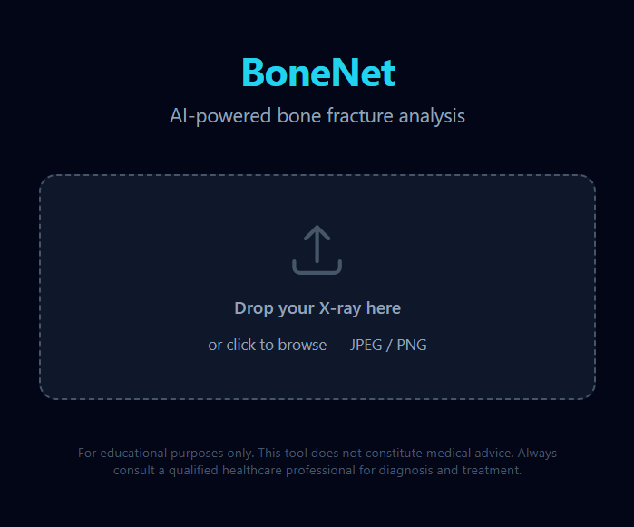
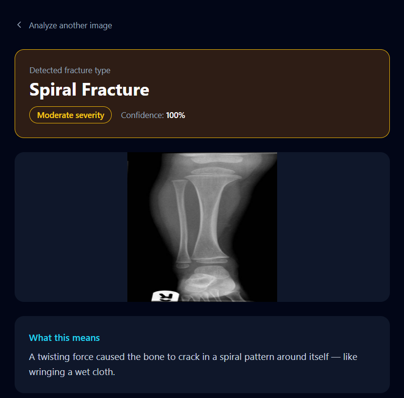
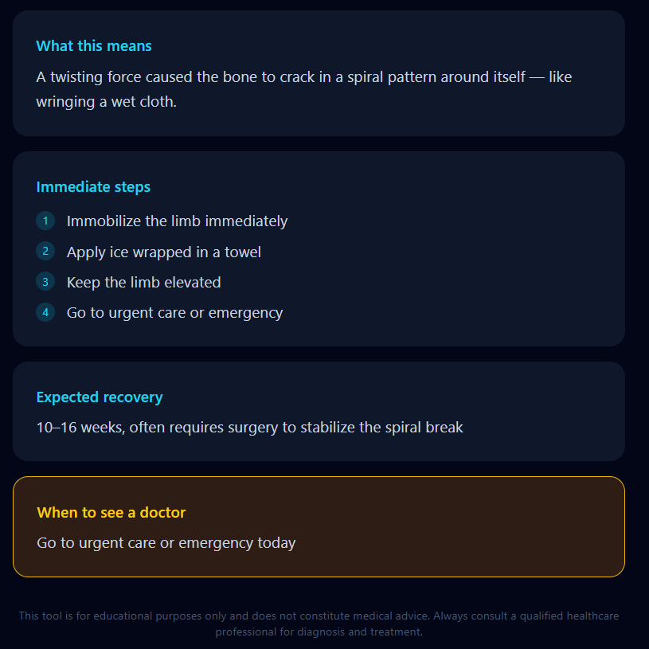
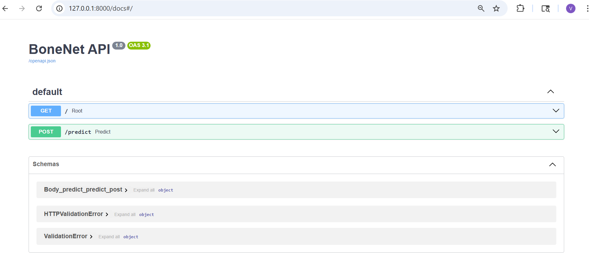

# BoneNet — AI Bone Fracture Analysis

BoneNetV2 is a custom deep learning architecture that classifies bone fractures from X-ray images into 10 categories with **99.12% accuracy in 20 epochs**, outperforming all benchmarked transfer learning models.

## Screenshots

### Upload Page


### Result Page



### Backend Page


## Project Structure
```
bonenet/
├── bonenet-backend/    ← FastAPI + TensorFlow backend
└── bonenet-frontend/   ← React + Tailwind patient app
```

## Model Performance

| Model | Accuracy |
|-------|----------|
| **BoneNetV2 (ours)** | **99.12%** |
| VGG19 | 87.5% |
| Xception | 85.2% |
| EfficientNetB0 | 83.8% |
| ResNet50 | 79.4% |
| MobileNetV2 | 77.6% |
| InceptionResNetV2 | 74.3% |
| VGG16 | 71.2% |
| DenseNet201 | 68.5% |

## Fracture Types Detected
1. Avulsion fracture
2. Comminuted fracture
3. Fracture Dislocation
4. Greenstick fracture
5. Hairline Fracture
6. Impacted fracture
7. Longitudinal fracture
8. Oblique fracture
9. Pathological fracture
10. Spiral Fracture

## Tech Stack

**Backend:** FastAPI, TensorFlow, Python 3.11  
**Frontend:** React, Vite, Tailwind CSS, React Router  
**Dataset:** [Bone Break Classification Dataset](https://www.kaggle.com/datasets/pkdarabi/bone-break-classification-image-dataset)

## Run Locally

### Backend
```bash
cd bonenet-backend
python -m venv venv
venv\Scripts\Activate.ps1
pip install -r requirements.txt
uvicorn main:app --reload
```
API runs at `http://127.0.0.1:8000`  
Docs at `http://127.0.0.1:8000/docs`

### Frontend
```bash
cd bonenet-frontend
npm install
npm run dev
```
App runs at `http://localhost:5173`
